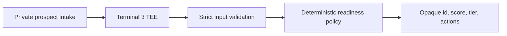

# SameDayDesk Audit Gate on Terminal 3

A small Rust WASM contract for the Terminal 3 T3N sandbox. It turns a private
AI search audit intake into a deterministic, public-safe action plan.

This is a real SameDayDesk use case, not a renamed sample. A sales or delivery
agent may know a prospect's private domain, contact email, budget, and internal
notes. The contract scores the technical signals inside the TEE and returns
only an opaque lead id, readiness score, readiness tier, and prioritized fixes.

## Privacy boundary

The `plan-audit` function accepts JSON with four private fields:

- `business_domain`
- `contact_email`
- `internal_notes`
- `monthly_budget_cents`

The response never contains any of them. The contract WIT declares no Terminal
3 HTTP, socket, storage, logging, or other custom host capability, so the
business logic has no network or durable-storage egress path. The compiled
component retains the Rust toolchain's standard WASI CLI adapter imports, which
`wasm-tools component wit` makes visible; the contract code does not call them.
The response includes `private_fields_withheld: 4` as an explicit policy result.



## Contract interface

```wit
plan-audit: func(req: generic-input) -> result<list<u8>, string>;
```

Example input:

```json
{
  "public_id": "lead-001",
  "business_domain": "private-prospect.example",
  "contact_email": "owner@private-prospect.example",
  "internal_notes": "Confidential expansion goal",
  "monthly_budget_cents": 75000,
  "signals": {
    "has_organization_schema": false,
    "has_local_business_schema": true,
    "has_person_authority_schema": false,
    "has_faq_schema": false,
    "has_llms_txt": false,
    "has_indexable_service_pages": true,
    "authority_evidence_count": 2,
    "location_consistency_pct": 70
  }
}
```

Example output:

```json
{
  "public_id": "lead-001",
  "readiness_score": 48,
  "readiness_tier": "weak",
  "priority_actions": [
    "Publish Organization JSON-LD with a stable legal and brand identity",
    "Connect named experts, credentials, and reviewed services in structured data"
  ],
  "private_fields_withheld": 4,
  "policy_version": "0.1.0"
}
```

The exact action list depends on every missing signal; the shortened example
above shows the response shape.

## Build and test

```bash
cargo fmt --check
cargo test --lib
cargo clippy --all-targets -- -D warnings
rustup target add wasm32-wasip2
cargo build --target wasm32-wasip2 --release
```

The component is written to:

```text
target/wasm32-wasip2/release/samedaydesk_audit_gate.wasm
```

Verify the exported interface with:

```bash
wasm-tools component wit target/wasm32-wasip2/release/samedaydesk_audit_gate.wasm
```

## Terminal 3 sandbox deployment

Complete the official Terminal 3 quickstart first. Keep the returned API key
outside this repository and set `T3N_API_KEY` only in the local environment.

Install the pinned SDK dependency, build the component, and deploy:

```bash
npm install
cargo build --target wasm32-wasip2 --release
T3N_API_KEY=0x... T3N_ALLOW_UNSAFE_TRUST=1 npm run deploy:testnet
```

The deploy script first requests the SDK's signed testnet trust manifest. At
the time of this deployment that official endpoint returned HTTP 405, so the
script refuses to proceed unless `T3N_ALLOW_UNSAFE_TRUST=1` explicitly permits
the SDK's testnet-only `{ unsafe_trust_server: true }` path. Never use that
opt-out for production. See [`evidence/BUGS.md`](evidence/BUGS.md).

Contract versions are immutable. On the same account, change
`contractVersion` in `scripts/deploy.mjs` and the matching Cargo/WIT policy
version before registering a revised build.

Use a short stable contract tail:

```text
sdd-audit
```

Register version `0.1.0` with the official `TenantClient` flow and this WASM
path. Save the returned `contract_id`, canonical script name, and invocation
output for the public completion report. Never commit the one-time API key.

## Reproducible evidence

The repository carries the following proof:

- a pinned public commit
- native test and Clippy output
- a successful `wasm32-wasip2` build
- the component's exported WIT
- the Terminal 3 DID and contract registration id
- one real `plan-audit` invocation with synthetic private fields
- a leak check showing those private fields do not appear in the response
- documented bugs or documentation gaps found during the walkthrough

## Origin

This repository is a fork of Terminal 3's official
[`z-tenant-flight`](https://github.com/Terminal-3/z-tenant-flight) reference,
as directed by their contract walkthrough. The implementation and use case in
this branch are original SameDayDesk work. Upstream remains configured for
comparison and attribution.
